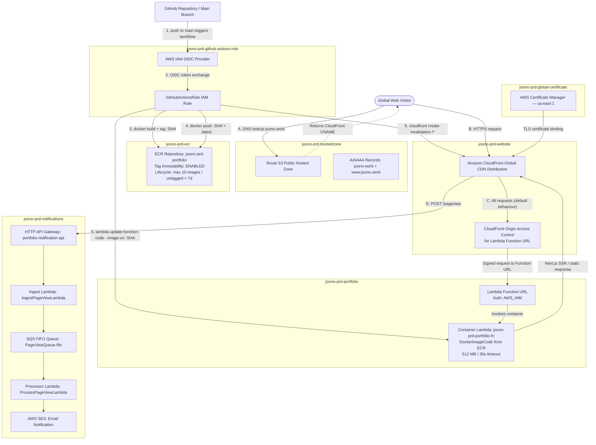

# System Architecture & Infrastructure Documentation

This document provides a comprehensive overview of the system architecture, infrastructure stacks, and CI/CD pipelines powering the personal portfolio application. The entire cloud ecosystem is managed as infrastructure-as-code (IaC) using the AWS Cloud Development Kit (CDK), ensuring repeatable, secure, and modular deployments.

---

## Technical Overview
The platform leverages a hybrid **Jamstack & Serverless Microservices** architecture:
- **Frontend Architecture:** Built using **Next.js**, delivering an optimized, high-performance static UI shell backed by hydration logic for dynamic features.
- **Backend Architecture:** Powered by **Webiny CMS** and custom serverless endpoints, orchestrating headless content management, telemetry capturing, and visitor tracking natively on AWS.
- **Infrastructure Delivery:** Managed as an isolated, globally accelerated edge configuration utilizing Amazon CloudFront and Route 53, entirely provisioned via programmatic AWS CDK stacks.

---

## Comprehensive Architecture Diagram

The Mermaid diagram below visualizes the physical and logical segregation of resources mapped to their respective AWS CDK stacks, detailing how data flows from source control deployment down to edge caching and telemetry storage.

